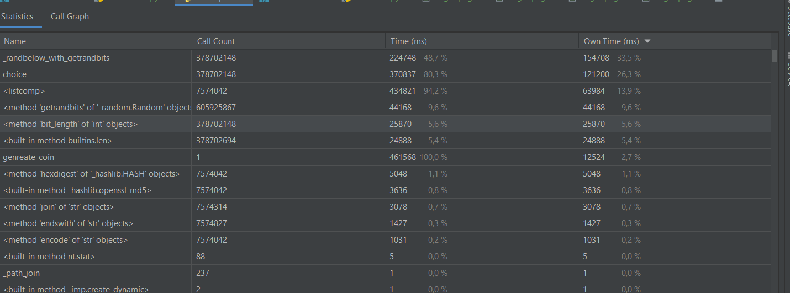

Задача IO-bound
Время выполнения синхронной проверки ссылок.

Нагрузка во время работы 5 исполнителей

Нагрузка во время работы 10 исполнителей

Нагрузка во время работы 100 исполнителей

Заметим что нагрузка на процессор, сеть и оперативную память зависит от окличества исполнителей - чем больше исполнителей - тем больше нагрузка
Время выполнения программы значительно уменьшилось:

при 5 исполнителях

при 10 исполнителях

при 100 исполнителях

Задача CPU-bound

Время затраченное на генерацию 5 монет на 1 ядре

Нагрузка при разбиении на 2 процесса

Время затраченное на генерацию 5 монет 2 процессами

Нагрузка при разбиения на 4 процесса

Время затраченное на генерацию 5 монет 4 процессами

Нагрузка при разбиения на 5 процессов

Время затраченное на генерацию 5 монет 5 процессами

Разбить на 100 процессов не получится - максимум 61.

Как видно из проведённых испытаний - в виду особенности программы особого ускорения работы не было, а вот нагрузка на процессор увеличивалась с увеличением кол-ва процессов. Однако такое происходило пока не дошли до 5 - так как процессор на моём компьютере 4 ядерный - процессор, разбить на большее кол-во исполнителей - просто бесполезно. 